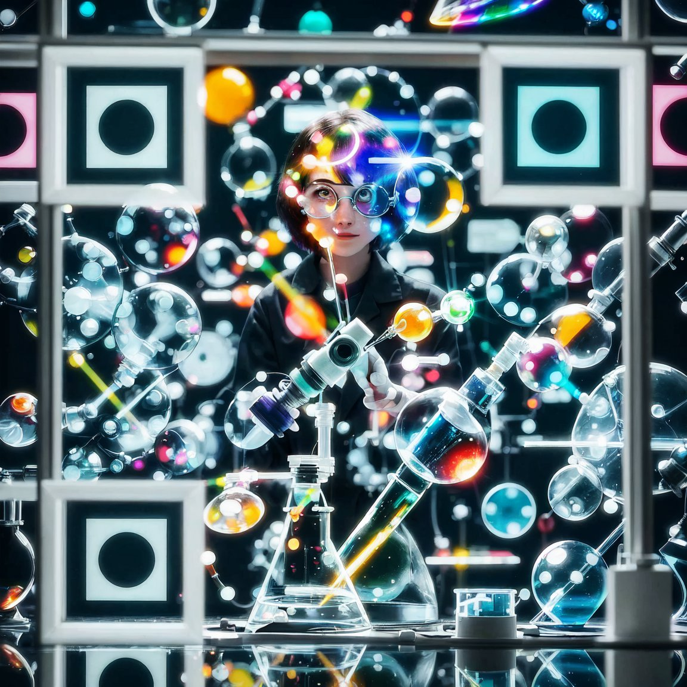

# Hi, 👋

I am (Heskey) Ang Zhao, born in 2002, and currently a graduate student of Xiamen University, majoring in computer graphics and 3D vision, with a particular focus on 3D/4D reconstruction/generation. I am currently honored to have the opportunity to work with Professor [Xiaohu Guo](https://personal.utdallas.edu/~xguo/) from [The University of Texas at Dallas](https://www.utdallas.edu/) and [Xiao DONG](https://staff.uic.edu.cn/xiaodong/en) from BNU-HKBU United International College. I also collaborate with [Zhiyang Dou](https://frank-zy-dou.github.io/) from [The University of Hong Kong](https://www.hku.hk/) closely. I hold a Bachelor's degree in Game Design from Communication University of China. I've previously spent wonderful times interning at [Tencent IEG](https://game.qq.com/web20220628txgame/index.html)(2024) and [Metamaker](https://www.metamaker.cn/#/aboutUs)(2022) as a research engineer, [Motphys](https://motphys.com/#/index)(2024) working on physics engine development, [Tencent CSIG](https://www.tencent.com/en-us/)(2022)  as a software engineer intern.

My research interests include:

* **Physically-based Rendering**: more specifically, (deep) real-time volumetric rendering and material modeling.
* **Physically-based Simulation**: deformable body simulation and cloth simulation.
* **Computer Character Animation**: high-quality motion generation/control for digital humans.
* **Computer Vision**: 3D/4D reconstruction/generation.

You can download my [**Resume for internship**](https://heskey0.github.io/files/Resume_AngZhao.pdf) here.

# 💻 Portfolio

* [Rendering](https://heskey0.github.io//portfolio/portfolio-rendering/)
* [Physical Simulation](https://heskey0.github.io//portfolio/portfolio-physical-simulation/)
* [Game Development](https://heskey0.github.io//portfolio/portfolio-game-development/)
* [Computer Character Animation](https://heskey0.github.io//portfolio/portfolio-computer-character-animation/)

# 📚 Blogs

* [Physically Based Rendering](https://heskey0.github.io//posts/2012/08/blog-post-1/)
* [Physical Simulation](https://heskey0.github.io//posts/2013/08/blog-post-2/)
* [Computer Character Animation](https://heskey0.github.io//posts/2014/08/blog-post-3/)
* [3D Vision](https://heskey0.github.io//posts/2015/08/blog-post-4/)
* [Business Administration](https://heskey0.github.io//posts/2016/08/blog-post-5/)

# 🧑🏻‍🏫 Teaching

* [Foundations of Fluid Simulation (in Chinese)](https://heskey0.github.io//teaching/2022-spring-fluid-simulation)
* [Foundations of Volumetric Rendering (in Chinese)](https://heskey0.github.io//teaching/2022-spring-volumetric-rendering)

# 📖 Education

- *2024.7 - Present*, Master, Xiamen University, Fujian province.
- *2020.9 - 2024.7*, Undergraduate, Communication University of China, Beijing.

# 🏢 Internships

(Research) Engineering:

- *2024.5 - 2024.6*, [Tencent IEG](https://game.qq.com/web20220628txgame/index.html) , **Game Engine**, Shenzhen.
- *2024.1 - 2024.4*, [Motphys](https://motphys.com/#/index), **Physics Engine**, Beijing.
- *2022.5 - 2022.9*, [Metamaker](https://www.metamaker.cn/#/aboutUs), **Digital Human**, Xiamen.
- *2022.1 - 2022.4*, [Tencent CSIG](https://www.tencent.com/en-us/) , **Digital Human**, Beijing.

Research Experience:

* *2024.5 - 2024.9*, [Xiamen University](https://www.xmu.edu.cn/), Research Assistant

# 🏓 Miscs.

Outside of research,

* I enjoy ping pong🏓, tennis🎾 and beatbox🎤.

# 📞 Contact

Wechat:

